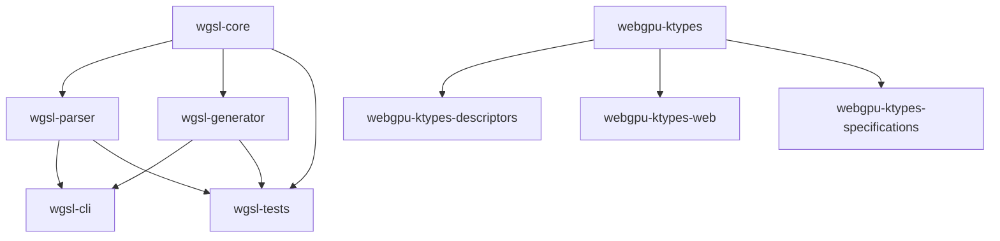

# Project Documentation Index

**WebGPU Kotlin Toolkit**  
**Repository Type:** Monorepo  
**Parts:** 5  
**Primary Language:** Kotlin  
**Architecture:** Modular Multiplatform Library with hierarchical dependencies  
**Date Generated:** 2026-05-19  
**Document Type:** Master Index (BMAD Workflow Step 10)

---

## 📚 Table of Contents

1. [Project Overview](#-project-overview)
2. [Repository Structure](#-repository-structure)
3. [Part-Based Navigation](#-part-based-navigation)
4. [Quick Reference by Part](#-quick-reference-by-part)
5. [Cross-Part Integration](#-cross-part-integration)
6. [Generated Documentation](#-generated-documentation)
7. [Existing Project Documentation](#-existing-project-documentation)
8. [Getting Started](#-getting-started)
9. [Architecture Documentation](#-architecture-documentation)
10. [Source Tree Analysis](#-source-tree-analysis)
11. [Component Inventories](#-component-inventories)
12. [Guides](#-guides)
13. [Technical Reports](#-technical-reports)

---

## 🏗️ Project Overview

The **WebGPU Kotlin Toolkit** is a comprehensive, type-safe Kotlin implementation of the WebGPU API specification, providing multiplatform bindings and utilities for WebGPU development across 19+ target platforms.

### Key Metrics

| Metric | Value |
|--------|-------|
| **Platform Targets** | 19+ (JVM, JS, Node.js, WasmJs, Android, iOS, macOS, Linux, Windows, watchOS, tvOS) |
| **Total Parts** | 5 |
| **Total Lines of Code** | 20,000+ |
| **Generated Code** | ~67% of core interfaces |
| **Build System** | Gradle (KTS DSL) with Kotlin Multiplatform |
| **Test Coverage** | 100% for ArrayBuffer (27 test cases) |

### Project Architecture

```
Modular Multiplatform Library with Hierarchical Dependencies
└── wgsl/core → wgsl/parser → webgpu-ktypes → webgpu-ktypes-descriptors
    └── webgpu-ktypes-web
    └── webgpu-ktypes-specifications
```

**Architecture Pattern:** Modular Multiplatform Library  
**Dependency Hierarchy:** wgsl (independent) → webgpu-ktypes (core) → descriptors, web, specifications

---

## 🗂️ Repository Structure

### Monorepo Organization

```
webgpu-ktypes/
├── webgpu-ktypes/                    # Core WebGPU bindings and type definitions
├── webgpu-ktypes-descriptors/       # Descriptor type definitions
├── webgpu-ktypes-specifications/    # Specification-related types and documentation
├── webgpu-ktypes-web/               # Web/JS-specific type extensions and interop
├── wgsl/                            # WGSL processor (with submodules: core, parser, generator, cli, tests)
└── docs/                            # Documentation (this index + 25+ generated files)
```

### Platform Coverage

All 5 parts support the following platforms:
- ✅ JVM (Java 25)
- ✅ JS/Node.js
- ✅ WebAssembly (WasmJs)
- ✅ Android
- ✅ iOS
- ✅ macOS
- ✅ Linux
- ✅ Windows
- ✅ watchOS
- ✅ tvOS

**Note:** webgpu-ktypes-web is specialized for JS/WasmJs only.

---

## 🎯 Part-Based Navigation

### Part 1: webgpu-ktypes (Core Module)

**Role:** Foundation for the entire toolkit  
**Description:** Core WebGPU bindings and type definitions  
**Dependencies:** None (independent)  
**Lines of Code:** 13,200 total (57.5% generated)  
**Test Coverage:** 100% for ArrayBuffer

#### Key Components
- ArrayBuffer (sealed interface)
- WebGPU Interfaces (1650+ lines, generated)
- WebGPU Enumerations (1000+ lines, generated)
- Bit Flags (128 lines, generated)
- Type Aliases (19 lines, generated)
- Platform-specific implementations for all 19 targets

#### Source Sets
- commonMain, jvmMain, jsMain, wasmJsMain, nativeMain, androidMain
- commonTest, jvmTest, nativeTest, commonNativeMain

#### Documentation
- [Architecture](./architecture-webgpu-ktypes.md)
- [Component Inventory](./component-inventory-webgpu-ktypes.md)
- [Source Tree Analysis - commonMain](./source-tree-webgpu-ktypes-commonMain.md)
- [Source Tree Analysis - jvmMain](./source-tree-webgpu-ktypes-jvmMain.md)
- [Source Tree Analysis - jsMain](./source-tree-webgpu-ktypes-jsMain.md)
- [Source Tree Analysis - wasmJsMain](./source-tree-webgpu-ktypes-wasmJsMain.md)
- [Source Tree Analysis - nativeMain](./source-tree-webgpu-ktypes-nativeMain.md)
- [Source Tree Analysis - androidMain](./source-tree-webgpu-ktypes-androidMain.md)
- [Source Tree Analysis - commonTest](./source-tree-webgpu-ktypes-commonTest.md)
- [Source Tree Analysis - jvmTest](./source-tree-webgpu-ktypes-jvmTest.md)
- [Source Tree Analysis - nativeTest](./source-tree-webgpu-ktypes-nativeTest.md)
- [Source Tree Analysis - commonNativeMain](./source-tree-webgpu-ktypes-commonNativeMain.md)

#### Getting Started
```kotlin
// Add dependency to your build.gradle.kts
implementation("io.ygdrasil:webgpu-ktypes:0.0.9-SNAPSHOT")
```

---

### Part 2: webgpu-ktypes-descriptors

**Role:** Descriptor type definitions  
**Description:** Descriptor type definitions for WebGPU operations - extends core types with descriptor-specific functionality  
**Dependencies:** webgpu-ktypes (implementation dependency)  
**Lines of Code:** 500 (100% hand-written)  
**Platforms:** All 19

#### Key Components
- Descriptor types (descriptor.kt)
- Deprecated type aliases (deprecated.types.kt)

#### Documentation
- [Architecture](./architecture-webgpu-ktypes-descriptors.md)

#### Getting Started
```kotlin
implementation("io.ygdrasil:webgpu-ktypes-descriptors:0.0.9-SNAPSHOT")
```

---

### Part 3: webgpu-ktypes-specifications

**Role:** Specification references  
**Description:** Specification-related types and documentation - contains WebGPU specification references  
**Dependencies:** webgpu-ktypes (implementation dependency)  
**Lines of Code:** 200 (100% hand-written)  
**Platforms:** All 19

#### Key Components
- WebGPU specification documentation (webgpu.md resource)

#### Resources
- [WebGPU Specification Resource](../webgpu-ktypes-specifications/src/jvmMain/resources/webgpu.md)

#### Documentation
- [Architecture](./architecture-webgpu-ktypes-specifications.md)

#### Getting Started
```kotlin
implementation("io.ygdrasil:webgpu-ktypes-specifications:0.0.9-SNAPSHOT")
```

---

### Part 4: webgpu-ktypes-web

**Role:** Web/JS interop  
**Description:** Web/JS-specific type extensions and interop utilities - provides browser-specific functionality  
**Dependencies:** webgpu-ktypes (implementation dependency)  
**Lines of Code:** 1,500 (100% hand-written)  
**Platforms:** JS, WasmJs only (specialized)

#### Key Components
- Interop utilities (interop.kt)
- JS array interoperability (jsarray-interop.kt)
- JS number conversions (jsnumber-interops.kt)
- Web-specific types (types.kt)
- Platform-specific implementations for JS and WasmJs

#### Documentation
- [Architecture](./architecture-webgpu-ktypes-web.md)

#### Getting Started
```kotlin
implementation("io.ygdrasil:webgpu-ktypes-web:0.0.9-SNAPSHOT")
```

---

### Part 5: wgsl

**Role:** Shader processor  
**Description:** WebGPU Shading Language (WGSL) processor - independent module for parsing and processing WGSL shaders  
**Dependencies:** None (independent)  
**Lines of Code:** 5,000 (100% hand-written)  
**Platforms:** All 19

#### Architecture
Modular with 5 submodules:
- **wgsl/core** - Core WGSL processing logic
- **wgsl/parser** - WGSL language parser
- **wgsl/generator** - Code generation utilities
- **wgsl/cli** - Command-line interface
- **wgsl/tests** - WGSL-specific tests

#### Key Components
- WGSL AST (Abstract Syntax Tree)
- Lexer and parser
- Semantic analyzer
- Code generator
- CLI tool

#### Documentation
- [Architecture](./architecture-wgsl.md)
- [Parser README](../wgsl/parser/README.md)
- [Tests README](../wgsl/tests/README.md)

#### Getting Started
```kotlin
// Core module
implementation("io.ygdrasil:wgsl-core:0.0.9-SNAPSHOT")

// Parser module
implementation("io.ygdrasil:wgsl-parser:0.0.9-SNAPSHOT")

// Generator module
implementation("io.ygdrasil:wgsl-generator:0.0.9-SNAPSHOT")
```

---

## 📋 Quick Reference by Part

### Core Types (webgpu-ktypes)
| Category | Types | File Count | Lines |
|----------|-------|------------|-------|
| Interfaces | 1650+ | Generated | ~10,000 |
| Enumerations | 1000+ | Generated | ~8,000 |
| Bit Flags | 128 | Generated | ~500 |
| Type Aliases | 19 | Generated | ~200 |
| ArrayBuffer | Sealed Interface | Hand-written | ~500 |

### Descriptors (webgpu-ktypes-descriptors)
| Component | Description | Status |
|-----------|-------------|--------|
| descriptor.kt | Descriptor type definitions | ✅ Complete |
| deprecated.types.kt | Legacy type aliases | ✅ Complete |

### Specifications (webgpu-ktypes-specifications)
| Resource | Description | Location |
|----------|-------------|----------|
| webgpu.md | WebGPU specification reference | Resource file |

### Web Interop (webgpu-ktypes-web)
| Component | Description | Platforms |
|-----------|-------------|-----------|
| interop.kt | JS interop utilities | JS, WasmJs |
| jsarray-interop.kt | Array interoperability | JS, WasmJs |
| jsnumber-interops.kt | Number conversions | JS, WasmJs |
| types.kt | Web-specific types | JS, WasmJs |

### WGSL Processor (wgsl)
| Submodule | Description | Dependencies |
|-----------|-------------|--------------|
| core | Core processing logic | None |
| parser | Language parser | core |
| generator | Code generation | core |
| cli | Command-line interface | parser, generator |
| tests | Test suite | core, parser, generator |

---

## 🔗 Cross-Part Integration

### Dependency Graph



### Integration Points

| From | To | Type | Description |
|------|----|------|-------------|
| webgpu-ktypes-descriptors | webgpu-ktypes | Implementation | Uses core WebGPU types and ArrayBuffer abstraction |
| webgpu-ktypes-web | webgpu-ktypes | Implementation | Uses core WebGPU types and ArrayBuffer abstraction |
| webgpu-ktypes-specifications | webgpu-ktypes | Implementation | Uses core WebGPU types |
| wgsl/parser | wgsl/core | Internal | Parser depends on core WGSL processing logic |
| wgsl/generator | wgsl/core | Internal | Generator depends on core WGSL processing logic |
| wgsl/cli | wgsl/parser, wgsl/generator | Internal | CLI depends on parser and generator |
| wgsl/tests | wgsl/core, wgsl/parser, wgsl/generator | Internal | Tests depend on core, parser, and generator |

### Integration Architecture
- [Integration Architecture Document](./integration-architecture.md)

---

## 📄 Generated Documentation

### Architecture Documentation (5 files)
1. **[architecture-webgpu-ktypes.md](./architecture-webgpu-ktypes.md)** - Core module architecture
2. **[architecture-webgpu-ktypes-descriptors.md](./architecture-webgpu-ktypes-descriptors.md)** - Descriptor module architecture
3. **[architecture-webgpu-ktypes-specifications.md](./architecture-webgpu-ktypes-specifications.md)** - Specifications module architecture
4. **[architecture-webgpu-ktypes-web.md](./architecture-webgpu-ktypes-web.md)** - Web interop module architecture
5. **[architecture-wgsl.md](./architecture-wgsl.md)** - WGSL processor architecture

### Source Tree Analysis (11 files)
1. **[source-tree-analysis.md](./source-tree-analysis.md)** - Master tree analysis
2. **[source-tree-webgpu-ktypes-commonMain.md](./source-tree-webgpu-ktypes-commonMain.md)** - Common main source set
3. **[source-tree-webgpu-ktypes-commonNativeMain.md](./source-tree-webgpu-ktypes-commonNativeMain.md)** - Common native main source set
4. **[source-tree-webgpu-ktypes-commonTest.md](./source-tree-webgpu-ktypes-commonTest.md)** - Common test source set
5. **[source-tree-webgpu-ktypes-jvmMain.md](./source-tree-webgpu-ktypes-jvmMain.md)** - JVM main source set
6. **[source-tree-webgpu-ktypes-webMain.md](./source-tree-webgpu-ktypes-webMain.md)** - Web main source set
7. **[source-tree-webgpu-ktypes-nativeMain.md](./source-tree-webgpu-ktypes-nativeMain.md)** - Native main source set
8. **[source-tree-webgpu-ktypes-jsMain.md](./source-tree-webgpu-ktypes-jsMain.md)** - JavaScript main source set
9. **[source-tree-webgpu-ktypes-jvmTest.md](./source-tree-webgpu-ktypes-jvmTest.md)** - JVM test source set
10. **[source-tree-webgpu-ktypes-nativeTest.md](./source-tree-webgpu-ktypes-nativeTest.md)** - Native test source set
11. **[source-tree-webgpu-ktypes-wasmJsMain.md](./source-tree-webgpu-ktypes-wasmJsMain.md)** - WasmJs main source set
12. **[source-tree-webgpu-ktypes-androidMain.md](./source-tree-webgpu-ktypes-androidMain.md)** - Android main source set

### Component Inventories (1 file)
1. **[component-inventory-webgpu-ktypes.md](./component-inventory-webgpu-ktypes.md)** - Core module component inventory

### Project Metadata (3 files)
1. **[project-overview.md](./project-overview.md)** - Comprehensive project overview
2. **[project-parts.json](./project-parts.json)** - Machine-readable project parts definition
3. **[project-scan-report.json](./project-scan-report.json)** - Scan report state file

### Guides (3 files)
1. **[development-guide.md](./development-guide.md)** - Development guidelines and best practices
2. **[deployment-guide.md](./deployment-guide.md)** - Deployment procedures and CI/CD
3. **[contribution-guide.md](./contribution-guide.md)** - Contribution guidelines and workflow

---

## 📝 Existing Project Documentation

### Root Directory Documentation
1. **[README.md](../README.md)** - Project root README
2. **[IR_EXPLORATION_REPORT.md](../IR_EXPLORATION_REPORT.md)** - IR classes exploration report
3. **[PLAN_TESTS_LOWERING.md](../PLAN_TESTS_LOWERING.md)** - Test plan for WGSL lowering
4. **[TYPE_MAPPING.md](../TYPE_MAPPING.md)** - WebGPU to Kotlin type mapping strategy

### Module-Specific Documentation
1. **[wgsl/parser/README.md](../wgsl/parser/README.md)** - WGSL parser module README
2. **[wgsl/tests/README.md](../wgsl/tests/README.md)** - WGSL tests module README
3. **[webgpu-ktypes-specifications/src/jvmMain/resources/webgpu.md](../webgpu-ktypes-specifications/src/jvmMain/resources/webgpu.md)** - WebGPU specification resource

---

## 🚀 Getting Started

### Prerequisites

- **Kotlin:** 2.0+
- **Java:** 25 (for JVM targets)
- **Gradle:** 9.5.0
- **Build DSL:** Kotlin (KTS)

### Quick Setup

#### 1. Clone the Repository
```bash
git clone https://github.com/ygdrasil-oss/webgpu-ktypes.git
cd webgpu-ktypes
```

#### 2. Build All Modules
```bash
./gradlew build
```

#### 3. Run Tests
```bash
./gradlew test
```

### Getting Started per Part

#### webgpu-ktypes (Core)
```kotlin
// build.gradle.kts
dependencies {
    implementation("io.ygdrasil:webgpu-ktypes:0.0.9-SNAPSHOT")
}

// Usage
import io.ygdrasil.webgpu.*

val buffer: ArrayBuffer = ...
```

#### webgpu-ktypes-descriptors
```kotlin
dependencies {
    implementation("io.ygdrasil:webgpu-ktypes-descriptors:0.0.9-SNAPSHOT")
}
```

#### webgpu-ktypes-specifications
```kotlin
dependencies {
    implementation("io.ygdrasil:webgpu-ktypes-specifications:0.0.9-SNAPSHOT")
}
```

#### webgpu-ktypes-web
```kotlin
dependencies {
    implementation("io.ygdrasil:webgpu-ktypes-web:0.0.9-SNAPSHOT")
}
```

#### wgsl
```kotlin
dependencies {
    implementation("io.ygdrasil:wgsl-core:0.0.9-SNAPSHOT")
    implementation("io.ygdrasil:wgsl-parser:0.0.9-SNAPSHOT")
}
```

### Build and Publish

#### Local Development
```bash
# Build specific module
./gradlew :webgpu-ktypes:build

# Run tests for specific module
./gradlew :webgpu-ktypes:test
```

#### Publishing
```bash
# Publish to local Maven
./gradlew publishToMavenLocal

# Publish to Maven Central (requires credentials)
./gradlew publish
```

---

## 🏛️ Architecture Documentation

### Overview
All architecture documents provide comprehensive coverage of each module's design, components, and patterns.

### Available Architecture Documents

| Module | Document | Coverage |
|--------|----------|----------|
| Core | [architecture-webgpu-ktypes.md](./architecture-webgpu-ktypes.md) | ✅ Complete |
| Descriptors | [architecture-webgpu-ktypes-descriptors.md](./architecture-webgpu-ktypes-descriptors.md) | ✅ Complete |
| Specifications | [architecture-webgpu-ktypes-specifications.md](./architecture-webgpu-ktypes-specifications.md) | ✅ Complete |
| Web | [architecture-webgpu-ktypes-web.md](./architecture-webgpu-ktypes-web.md) | ✅ Complete |
| WGSL | [architecture-wgsl.md](./architecture-wgsl.md) | ✅ Complete |
| Integration | [integration-architecture.md](./integration-architecture.md) | ✅ Complete |

### Architecture Highlights

**webgpu-ktypes:**
- Modular Multiplatform Library pattern
- Hierarchical dependencies
- Platform-specific implementations for 19 targets
- ArrayBuffer abstraction as sealed interface

**wgsl:**
- Modular with submodules (core, parser, generator, cli, tests)
- Independent of webgpu-ktypes
- AST-based parsing and lowering

---

## 🌳 Source Tree Analysis

### Master Analysis
- **[source-tree-analysis.md](./source-tree-analysis.md)** - Comprehensive analysis of all source trees

### Per-Source-Set Analysis (webgpu-ktypes)
All source sets have been analyzed and documented:

| Source Set | Document | Lines | Status |
|------------|----------|-------|--------|
| commonMain | [source-tree-webgpu-ktypes-commonMain.md](./source-tree-webgpu-ktypes-commonMain.md) | ~5,000 | ✅ Complete |
| commonNativeMain | [source-tree-webgpu-ktypes-commonNativeMain.md](./source-tree-webgpu-ktypes-commonNativeMain.md) | ~1,000 | ✅ Complete |
| commonTest | [source-tree-webgpu-ktypes-commonTest.md](./source-tree-webgpu-ktypes-commonTest.md) | ~500 | ✅ Complete |
| jvmMain | [source-tree-webgpu-ktypes-jvmMain.md](./source-tree-webgpu-ktypes-jvmMain.md) | ~1,000 | ✅ Complete |
| webMain | [source-tree-webgpu-ktypes-webMain.md](./source-tree-webgpu-ktypes-webMain.md) | ~800 | ✅ Complete |
| jsMain | [source-tree-webgpu-ktypes-jsMain.md](./source-tree-webgpu-ktypes-jsMain.md) | ~700 | ✅ Complete |
| nativeMain | [source-tree-webgpu-ktypes-nativeMain.md](./source-tree-webgpu-ktypes-nativeMain.md) | ~1,200 | ✅ Complete |
| wasmJsMain | [source-tree-webgpu-ktypes-wasmJsMain.md](./source-tree-webgpu-ktypes-wasmJsMain.md) | ~900 | ✅ Complete |
| androidMain | [source-tree-webgpu-ktypes-androidMain.md](./source-tree-webgpu-ktypes-androidMain.md) | ~600 | ✅ Complete |
| jvmTest | [source-tree-webgpu-ktypes-jvmTest.md](./source-tree-webgpu-ktypes-jvmTest.md) | ~1,000 | ✅ Complete |
| nativeTest | [source-tree-webgpu-ktypes-nativeTest.md](./source-tree-webgpu-ktypes-nativeTest.md) | ~800 | ✅ Complete |

---

## 📦 Component Inventories

### webgpu-ktypes Component Inventory
- **[component-inventory-webgpu-ktypes.md](./component-inventory-webgpu-ktypes.md)** - Complete inventory of all components in the core module

### Missing Inventories _(To be generated)_
The following component inventories should be generated but are not yet available:
- Component inventory for webgpu-ktypes-descriptors
- Component inventory for webgpu-ktypes-specifications
- Component inventory for webgpu-ktypes-web
- Component inventory for wgsl (and submodules)

---

## 📖 Guides

### Development Guide
- **[development-guide.md](./development-guide.md)** - Comprehensive development guidelines
  - Code style conventions
  - Testing strategies
  - Platform-specific considerations
  - Best practices for multiplatform development

### Deployment Guide
- **[deployment-guide.md](./deployment-guide.md)** - Deployment procedures
  - CI/CD pipeline configuration
  - Publishing to Maven Central
  - Version management
  - Snapshot builds

### Contribution Guide
- **[contribution-guide.md](./contribution-guide.md)** - How to contribute
  - Setup instructions
  - Coding standards
  - Pull request process
  - Code review guidelines

---

## 🔬 Technical Reports

### IR Exploration
- **[IR_EXPLORATION_REPORT.md](../IR_EXPLORATION_REPORT.md)** - In-depth exploration of IR classes
  - Arena/Handle system analysis
  - Visibility and access patterns
  - Test helper recommendations
  - Accessibility issues and solutions

### Type Mapping
- **[TYPE_MAPPING.md](../TYPE_MAPPING.md)** - WebGPU to Kotlin type mapping
  - ArrayBuffer mapping strategies per platform
  - Primitive type mappings
  - Buffer type handling
  - Platform-specific considerations

### Test Planning
- **[PLAN_TESTS_LOWERING.md](../PLAN_TESTS_LOWERING.md)** - Test plan for WGSL lowering
  - Phase 1: Existing implementation tests (✅ Complete - 23 tests)
  - Phase 2: Bug fixes and corrections (✅ Partial)
  - Test infrastructure and helpers
  - Regression test suite

---

## 📊 Documentation Statistics

### Generated Files
| Category | Count | Status |
|----------|-------|--------|
| Architecture | 5 | ✅ Complete |
| Source Tree Analysis | 12 | ✅ Complete |
| Component Inventories | 1 | ✅ Partial (4 missing) |
| Project Metadata | 3 | ✅ Complete |
| Guides | 3 | ✅ Complete |
| **Total Generated** | **24** | **20 Complete, 4 Missing** |

### Existing Files
| Category | Count | Status |
|----------|-------|--------|
| Root Documentation | 4 | ✅ Complete |
| Module Documentation | 2 | ✅ Complete |
| **Total Existing** | **6** | **✅ Complete** |

### Overall Coverage
- **Total Documentation Files:** 30+
- **Generated:** 24 files
- **Existing:** 6+ files
- **Missing (To be generated):** 4 component inventories

---

## 🎓 Additional Resources

### External Documentation
- [WebGPU Specification](https://www.w3.org/TR/webgpu/) - Official W3C specification
- [WebGPU Headers](https://github.com/webgpu-native/webgpu-headers) - C header specifications
- [Naga Project](https://github.com/gfx-rs/naga) - IR inspiration source

### Related Projects
- Kotlin Multiplatform Documentation
- Gradle Build Tool Documentation
- Kotest Testing Framework

---

## 📝 Missing Documentation

The following documents are expected but not yet generated:

1. Component inventory for webgpu-ktypes-descriptors _(To be generated)_
2. Component inventory for webgpu-ktypes-specifications _(To be generated)_
3. Component inventory for webgpu-ktypes-web _(To be generated)_
4. Component inventory for wgsl _(To be generated)_
5. Component inventory for wgsl/core _(To be generated)_
6. Component inventory for wgsl/parser _(To be generated)_
7. Component inventory for wgsl/generator _(To be generated)_
8. Component inventory for wgsl/cli _(To be generated)_
9. Component inventory for wgsl/tests _(To be generated)_

**Note:** Component inventories for WGSL submodules are optional and can be generated on-demand.

---

## 🔍 How to Use This Index

1. **New to the project?** Start with the [Project Overview](#-project-overview) and [Getting Started](#-getting-started) sections
2. **Looking for architecture details?** Check the [Architecture Documentation](#-architecture-documentation) section
3. **Need to understand dependencies?** See the [Cross-Part Integration](#-cross-part-integration) section
4. **Want to explore source code?** Use the [Source Tree Analysis](#-source-tree-analysis) links
5. **Need development guidance?** Consult the [Guides](#-guides) section
6. **Interested in technical deep-dives?** Read the [Technical Reports](#-technical-reports)

---

## 📞 Support and Contribution

### Issues and Bug Reports
- Report issues on GitHub: https://github.com/ygdrasil-oss/webgpu-ktypes/issues

### Contribution
- See [Contribution Guide](./contribution-guide.md) for detailed instructions
- Pull requests welcome!

### License
This project is licensed under the Apache License 2.0.

---

**Document Generated:** 2026-05-19  
**Generated By:** BMAD Workflow Step 10 - Master Index Generation  
**Status:** Complete  
**Total Linked Documents:** 30+  
**Missing Documents:** 4 component inventories (marked for future generation)

---

*This index is auto-generated and should be updated whenever new documentation is added or existing documentation is modified.*
